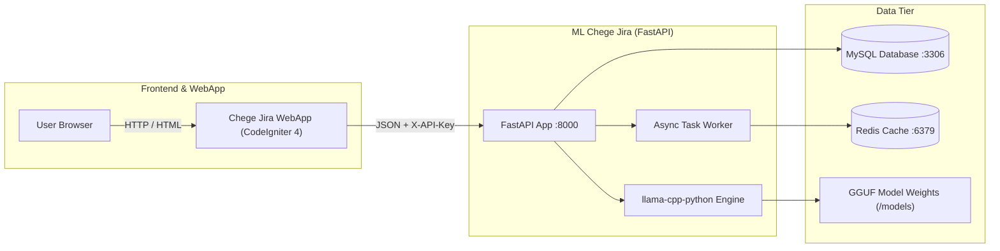

# Engineering Documentation

Welcome to the engineering documentation for **ML Chege Jira** — the local LLM inference microservice and async AI worker backend for the Chege Jira ecosystem.

## Documentation Index

| I want to… | Document Link | Description |
|------------|---------------|-------------|
| **Run the system without coding** | [../README.md](../README.md) | Copy-paste setup and launch with Docker |
| **Understand the architecture** | [architecture/overview.md](architecture/overview.md) | C4 containers, trust boundaries, system layout |
| **Inspect inter-service protocols** | [architecture/communication.md](architecture/communication.md) | WebApp ↔ ML API contracts, auth, and sequences |
| **Explore storage & databases** | [architecture/data-and-storage.md](architecture/data-and-storage.md) | MySQL schema, Redis cache, and GGUF model files |
| **Review deployment strategies** | [architecture/deployment.md](architecture/deployment.md) | Railway cloud, Docker Compose, and bare-metal |
| **Analyze threat models & security** | [architecture/threat-model.md](architecture/threat-model.md) | STRIDE analysis, API key enforcement, prompt injection |
| **Read the API contract** | [api/contract.md](api/contract.md) | Endpoint catalog, payloads, and response structures |
| **Download OpenAPI specification** | [api/openapi.yaml](api/openapi.yaml) | Interactive OpenAPI 3.0 YAML definition |
| **Develop FastAPI backend** | [services/fastapi.md](services/fastapi.md) | Router layout, dependency injection, and async tasks |
| **Manage GGUF models & LLMs** | [services/ml.md](services/ml.md) | Quantization, context windows, and llama.cpp engine |
| **Setup native dev environment** | [engineering/local-development.md](engineering/local-development.md) | Python 3.11, uv, compilers, and local debugging |
| **Safely make behavior changes** | [engineering/making-changes.md](engineering/making-changes.md) | Definition of Done and change workflows |
| **Work with database & migrations** | [engineering/database.md](engineering/database.md) | Schema guard, tables, and query optimization |
| **Run tests & coverage** | [engineering/testing.md](engineering/testing.md) | pytest, pytest-asyncio, and mocked LLM inference |
| **Inspect CI/CD automation** | [engineering/ci.md](engineering/ci.md) | GitHub Actions linters, mypy, and test matrix |
| **Review release train & versions** | [engineering/release.md](engineering/release.md) | Polyrepo version compatibility matrix |
| **Execute runbooks** | [runbooks/restart.md](runbooks/restart.md) | Service restarts, crash recovery, and troubleshooting |
| **Read Architecture Decisions** | [adr/0001-llama-cpp-python-local-inference.md](adr/0001-llama-cpp-python-local-inference.md) | ADR records explaining key design decisions |

## Architecture at a Glance

