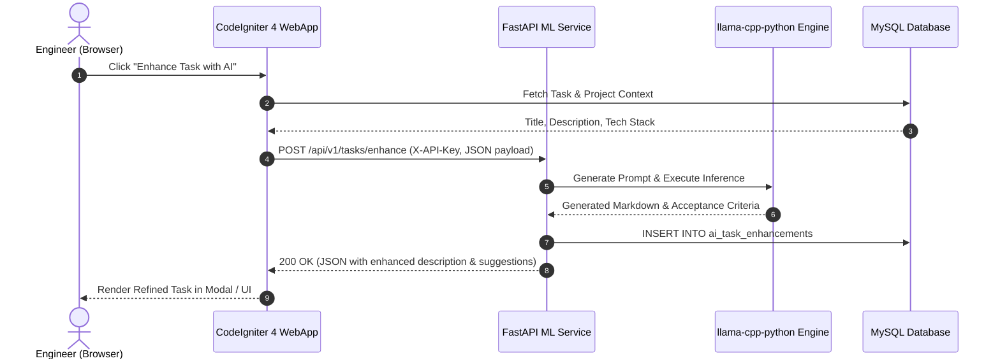
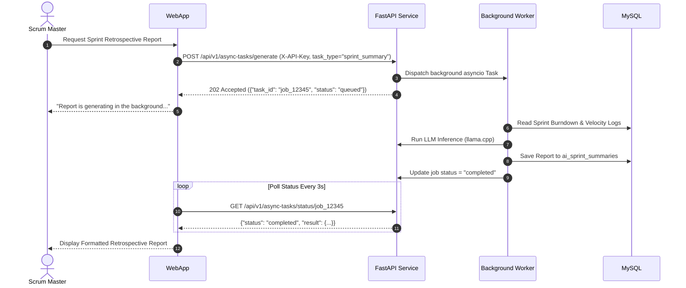

# Inter-Service Communication

This document specifies the protocols, authentication mechanisms, sequence flows, and error contracts between the **CodeIgniter 4 WebApp** and the **FastAPI ML Service**.

## Communication Protocols

| Source | Destination | Protocol | Authentication | Base URL (Dev / Prod) | Purpose |
|--------|-------------|----------|----------------|------------------------|---------|
| Browser | WebApp | HTTP / HTTPS | Session Cookie + CSRF | `http://localhost:9001` | User interface and interaction |
| WebApp | ML Backend | HTTP / JSON | `X-API-Key` Header | `http://ml-chege-jira:8000/api/v1` | AI copilot inference and telemetry |
| ML Backend | MySQL | Async TCP (`aiomysql`) | DB Username & Password | `mysql:3306` | Schema query & AI result storage |
| ML Backend | Redis | TCP (`redis-py`) | Redis Auth / Default | `redis:6379/0` | Async task state & job tracking |

## Core Sequence: Synchronous Task AI Enhancement

When a user requests AI refinement or acceptance criteria generation for a task:



## Core Sequence: Asynchronous Sprint Retrospective Report

For heavy workloads that exceed synchronous HTTP timeouts:



## Standard Error Response Format

All API errors return RFC 7807 compliant JSON envelopes:

```json
{
  "success": false,
  "error": {
    "code": "model_not_found",
    "message": "The requested model 'llama3-8b' is not present in /app/models",
    "details": null
  }
}
```
