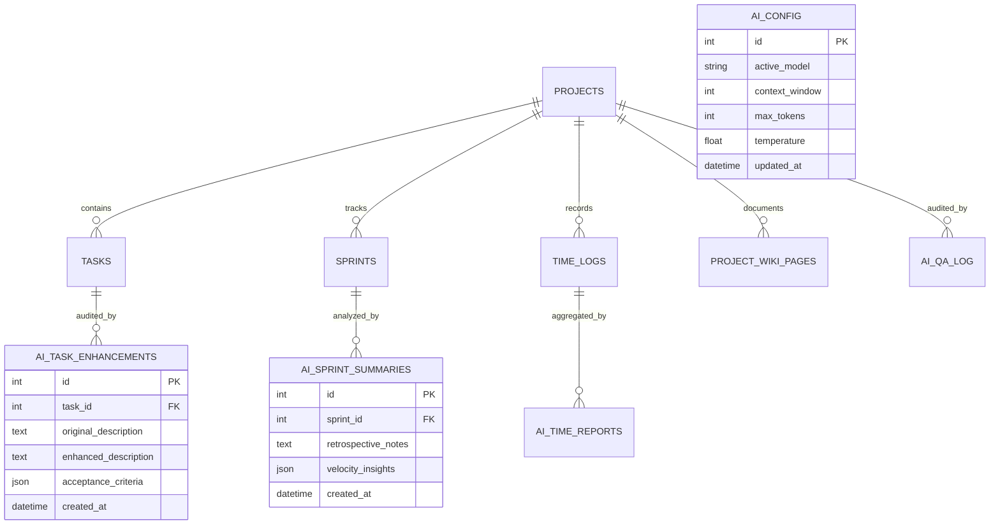

# Data and Storage Architecture

This document describes the data persistence models, relational database schemas, model file management, and caching strategies used by **ML Chege Jira**.

## Entity Relationship Diagram

The ML backend reads core project entities and writes exclusively to dedicated `ai_*` tables:

## Relational Database Tables

### Read-Only Tables (Owned by CodeIgniter 4 WebApp)
- `users`: User identity and profile records.
- `projects`: High-level agile project metadata, slug, tech stack, and goals.
- `tasks`: Individual issues, descriptions, assignees, priorities, and statuses.
- `sprints`: Agile sprint cycles, start/end dates, burndown metrics.
- `time_logs`: Stopwatch timesheet records, durations, rates, billable flags.
- `project_wiki_pages`: Markdown documentation and architectural notes.

### Read/Write Tables (Owned by ML Backend)
- `ai_config`: Global runtime settings (active model, temperature, context limit).
- `ai_task_enhancements`: Historical records of task AI rewrites and suggested test criteria.
- `ai_sprint_summaries`: Automated sprint retrospective reports and risk evaluations.
- `ai_time_reports`: Aggregated timesheet summaries and anomaly detection logs.
- `ai_qa_log`: Code review and automated QA validation audit trails.

## GGUF Model Weights Storage

Model binaries are stored as quantized `.gguf` files inside the mounted directory `/app/models`:
- **Format**: GGUF (GPT-Generated Unified Format) compatible with `llama.cpp`.
- **Quantization**: `Q4_K_M` (4-bit medium quantization offering optimum balance of VRAM/RAM footprint and inference accuracy).
- **Supported Model Registry**:
  - `phi3-mini`: 3.8B parameters (~2.2 GB) — ultra-fast, low memory footprint.
  - `mistral-7b`: 7.3B parameters (~4.1 GB) — deep reasoning and code comprehension.
  - `llama3-8b`: 8.0B parameters (~4.7 GB) — comprehensive multilingual and analytical capability.
  - `deepseek-7b`: 7.0B parameters (~4.2 GB) — specialized code generation and bug analysis.
