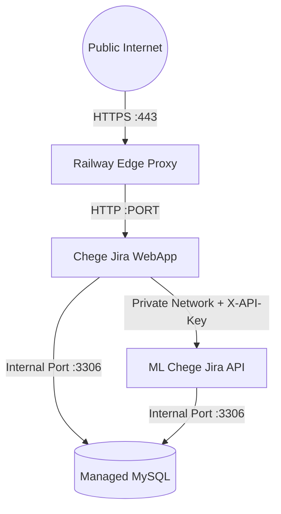

# Deployment Architecture

This document outlines deployment configurations for **ML Chege Jira** across local Docker environments, Railway cloud infrastructure, and bare-metal production hosts.

## Target Deployment Topologies

### 1. Railway Multi-Service Cloud Deployment (Current Production)
On Railway, the system runs as three connected services:
- **`Chege-Jira-WebApp`**: Public Web service listening on `$PORT`.
- **`ML-Chege-Jira`**: Private backend worker listening on `$PORT` with auto-injected MySQL service connection strings (`MYSQLHOST`, `MYSQLUSER`, `MYSQLPASSWORD`, `MYSQLDATABASE`, `MYSQLPORT`).
- **`MySQL Database Plugin`**: Managed MySQL instance with persistent volume.

### 2. Local Docker Compose Topology
Locally, the services connect over a shared bridge network (`hosts-shared-network`):
- `docker-compose.yml` mounts local `./models` as a read-write volume.
- Fast reloading enabled in development.

## Resource Allocation & Hardware Tuning

| Resource | Recommended Minimum | Production Recommended |
|----------|---------------------|------------------------|
| **RAM** | 8 GB | 16 GB - 32 GB |
| **vCPU** | 4 Cores | 8 Cores (AVX2 / AVX-512 support) |
| **GPU VRAM** | 0 (CPU-only) | 8 GB+ (NVIDIA CUDA for layer offloading) |
| **Storage** | 15 GB NVMe SSD | 50 GB NVMe SSD |

## Zero-Downtime Rolling Update Strategy

1. Model downloads are performed during initialization or mounted as an external volume to keep Docker image layers lean (~350 MB without weights).
2. Health check probing at `/api/v1/health` verifies both database connectivity and LLM engine readiness before routing live traffic.
