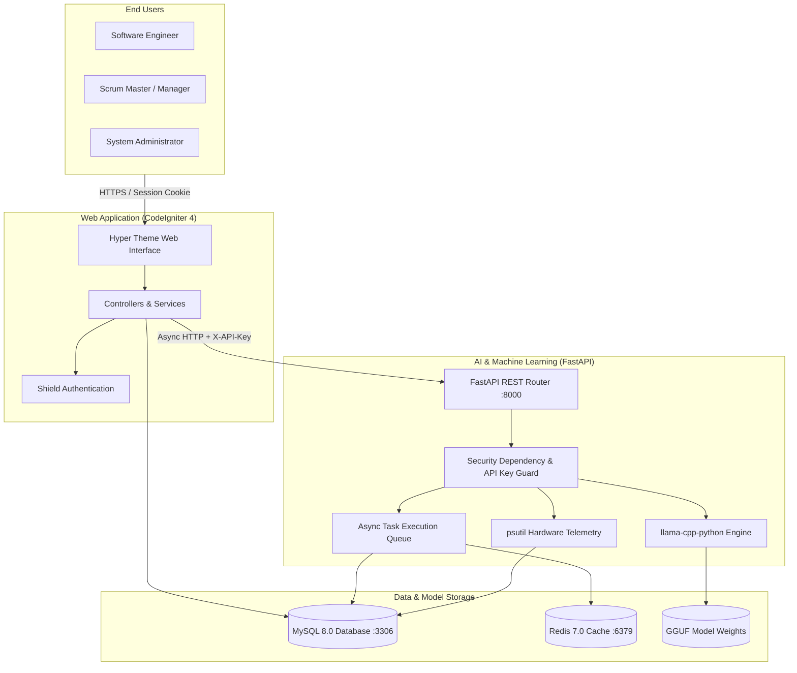

# Architecture Overview

This document details the system topology, container boundaries, component responsibilities, and trust zones of **ML Chege Jira**.

## System Context & C4 Container Layout

The Chege Jira ecosystem is composed of a decoupled polyrepo architecture where the PHP CodeIgniter 4 WebApp acts as the user interface and business logic coordinator, while the Python FastAPI service operates as the on-premise AI copilot and inference engine.

## Container Inventory

| Container / Service | Technology | Port | Repository | Role |
|---------------------|------------|------|------------|------|
| `chege-jira-webapp` | PHP 8.2 + CodeIgniter 4 + Apache | `80` / `9001` | `Chege-Jira-WebApp` | Web UI, authentication, project workflows, timesheets |
| `ml-chege-jira` | Python 3.11+ + FastAPI + llama.cpp | `8000` | `ML-Chege-Jira` | Task enhancement, QA review, sprint analysis, LLM inference |
| `mysql` | MySQL 8.0 | `3306` | Shared | Relational data store for tasks, projects, time logs, AI history |
| `redis` | Redis 7.0 Alpine | `6379` | Shared | Cache, session store, asynchronous background task queue |

## Trust Boundaries & Security Zones

1. **Public Zone (Internet → WebApp)**:
   - Protected by CodeIgniter Shield session authentication, CSRF tokens, and rate limits.
   - Users interact exclusively with the WebApp.
2. **Internal Service Zone (WebApp → ML Backend)**:
   - All ML endpoints are isolated and require an `X-API-Key` shared secret header.
   - Direct external access to `/api/v1/*` is restricted by network policies in production.
3. **Data Isolation Zone (ML Backend ↔ MySQL)**:
   - ML backend performs read-only queries against core tables (`projects`, `tasks`, `sprints`, `time_logs`, `project_wiki_pages`) and write queries exclusively against dedicated `ai_*` audit/result tables.
